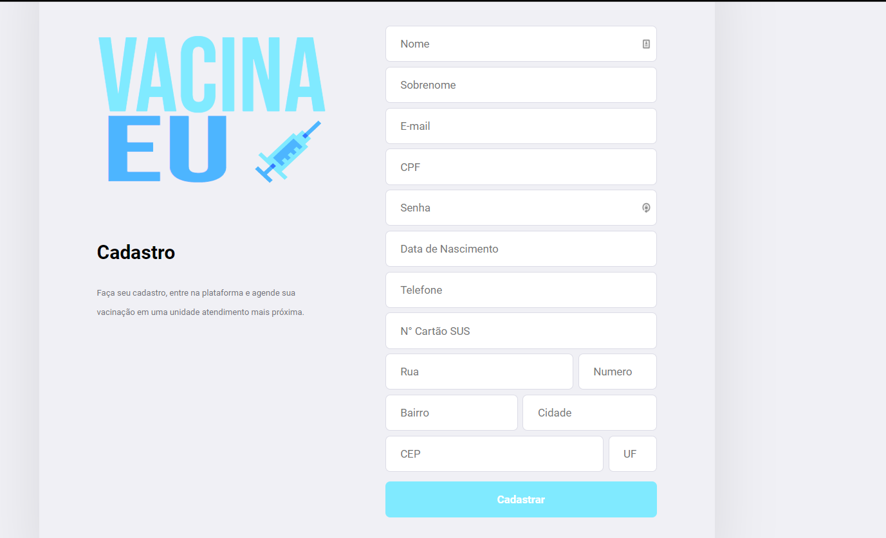
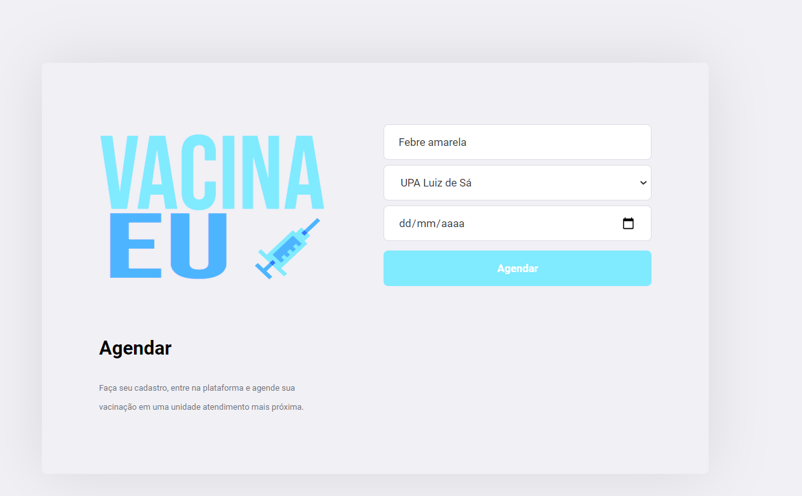
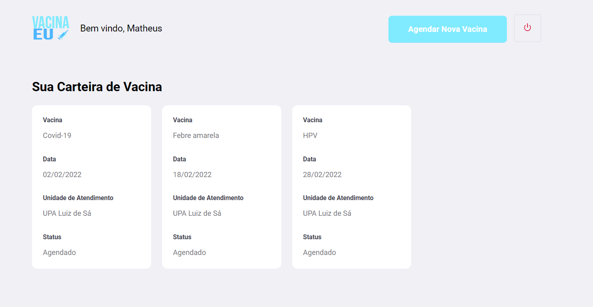

<p align="center">
     
        
           
              

  <h5 align="center">Vacina Eu.</h5>

  <p align="center">
    Projeto desenvolido por Matheus Teodoro
    <br />
    <a href="/">Versão Mobile (em breve)</a>
    ·
 
  </p>
</p>

# 🎵 Sobre o projeto

O **Vacina Eu** foi desenvolvido com a proposta de uma aplicação web em React e mobile em React Native que consomem o mesmo back-end em Java, atualmente em outro repositorio.

Hoje o Vacina Eu tem a seguinte proposta:
* **Moods** já previamente cadastrados no banco
* Cadastro de **profile** pela aplicação web
* Esse cadastro já integrado com mapa para captura da geolocalização
* Pesquisa de **profiles** pelo app mobile
* Um único back-end que gerencia as requisições dos dois apps

### Stack
- [TypeScript](https://www.typescriptlang.org/)
- [Node.js](https://nodejs.org/en/)
- [ReactJS](https://reactjs.org/)
- [React Native](https://reactnative.dev/)

### Layouts


# 🖥️ Para usar

### Requisitos

- **[Node.js](https://nodejs.org/en/)** instalado na máquina e de um gerenciador de dependencias (**[npm](https://www.npmjs.com/)** ou **[yarn](https://yarnpkg.com/)**)
- **[Expo](https://expo.io/)** instalado **globalmente**


```sh

```

```sh
  # Instalando as dependências
  $ npm install

  ## Criando o banco (scripts no package.json)
  $ cd server
  $ npm run knex:migrate
  $ npm run knex:seed

  # Rodando o back-end
  $ npm run dev

  # Rodando o app web
  $ cd ../web
  $ npm start

  # Rodando o app mobile
  $ cd ../mobile
  $ npm start
```

---

